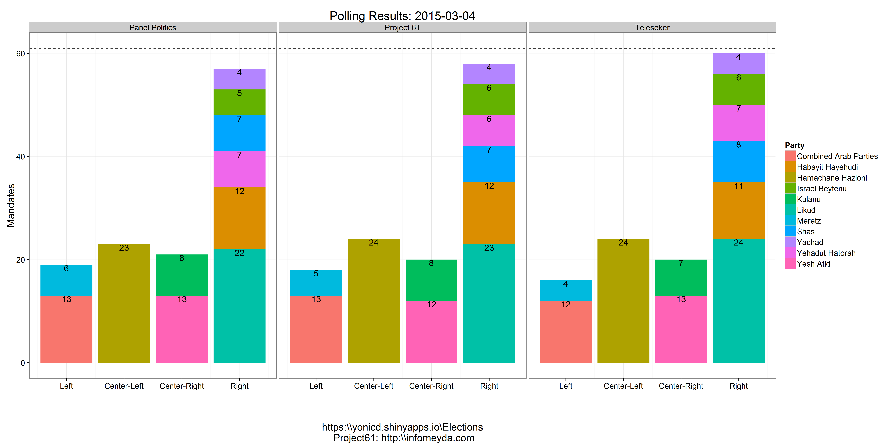
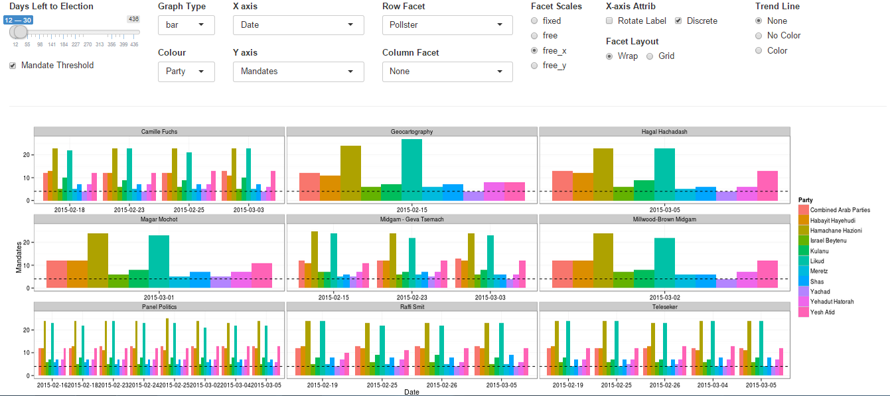
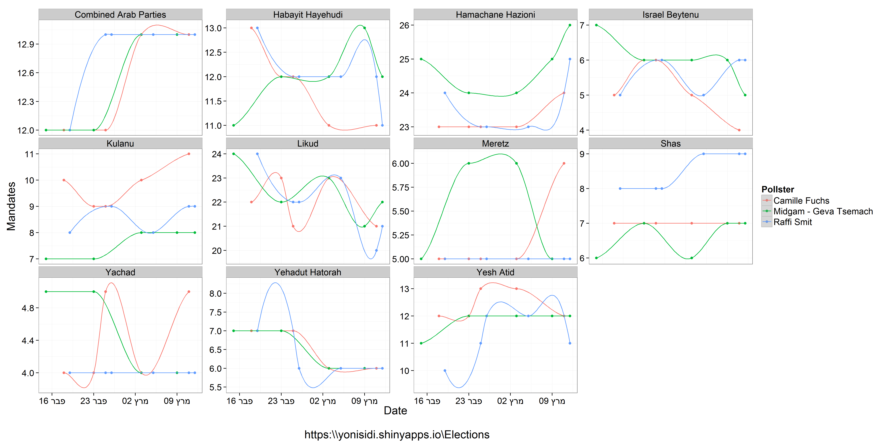
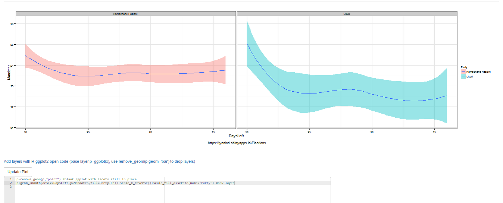
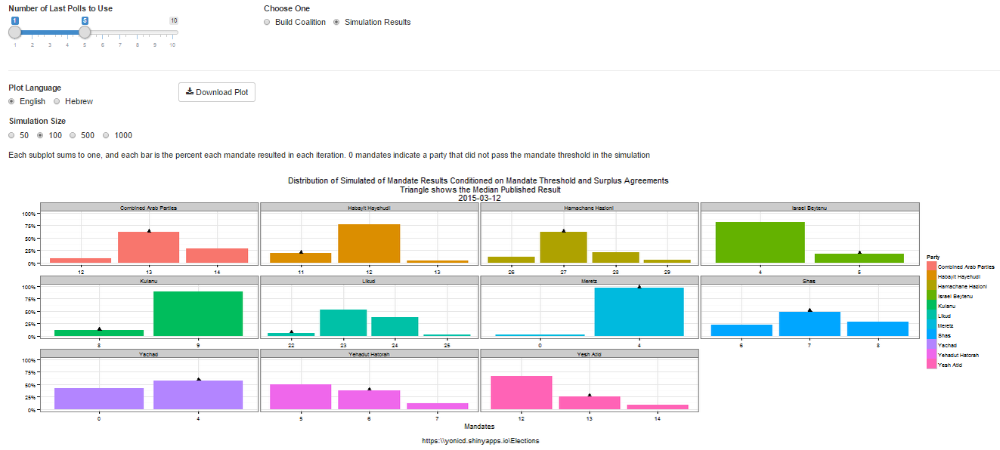

<!--- ####Fun with Polls: Israel Edition --->

The Israeli elections are coming up this Tuesday, 17/3/2015. They are a bit more complicated than your average US presidential race. The elections in Israel are based on nationwide proportional representation. The electoral threshold is 3.25% and the number of seats (or mandates) out of a total of 120 is proportional to the number of votes it recieves, so the threshold roughly translates to at least four mandates. The Israeli system is a multi-party system and is based on coalition governments. Multi-party is putting it mildly, there are 11 that have a chance to pass the mandate threshold. 

There are two major parties, Hamachane Hazioni (Left Wing) and the Likud (Right Wing), that are hoping to garner between 16%-25% of the votes, 20-30 mandates. The main winners though are the medium size parties that recomend to the President who they think has the best chance to construct the next government, so yes there is a good possibility that the general elections winner will not be one constructing the coalition. Making the actual winners the parties that create the biggest coalition which exceeds 60 mandates.

An abundance of polling has been continually published during the run up and the variaety of pollsters and publishers is hard to keep track of as a casual voter trying to gauge the temperature of the political landscape. I came across a great realtime [database by Project 61](http://infomeyda.com/) on google docs of past and present polling result information and decided that it was a great opportunity to learn the [Shiny library of RStudio](http://shiny.rstudio.com/) and create an app that I can check current and past results. So after I figured out how to connect google docs to  R, I had a self updating app that became a nice place to keep track of polling every day, check trends and distributions using interactive ggplot2 graphs and simulate coalition outcomes.

<!--- ####The Israel Election Polls Analysis Depot is an interactive web application for analyzing the elections in Israel powered by the [Shiny library of RStudio](http://shiny.rstudio.com/) and real time published polling data from the [Project 61](http://infomeyda.com/) database.

 be found on the [shiny servers](https://yonisidi.shinyapps.io/Elections) or can --->

####The App can be run through Github

```r
#changing locale to run on Windows
if (Sys.info()[1] == "Windows") Sys.setlocale("LC_ALL","Hebrew_Israel.1255") 

#check to see if libraries need to be installed
libs=c("shiny","shinyAce","httr","XML","stringr","ggplot2","scales","plyr","reshape2","dplyr")
x=sapply(libs,function(x)if(!require(x,character.only = T)) install.packages(x));rm(x,libs)

#run App
shiny::runGitHub("Elections","yonicd",subdir="shiny")

#reset to original locale on Windows
if (Sys.info()[1] == "Windows") Sys.setlocale("LC_ALL")

```

# Application Layout:

1. [Current Polling](#current-polling)
2. [Election Analyis](#election-analysis)
3. [Mandate Simulator and Coalition Whiteboard](#mandate-simulator-and-coalition-whiteboard)
4. [Polling Database](#polling-database)

# Usage Instructions:

## Current Polling
  * The latest polling day results published in the media and the prediction made using the Project 61 weighting schemes. The parties are stacked into blocks to see which block has best chance to create a coalition.



The Project 61 prediction is based past pollster error deriving weights from the 2003,2006,2009 and 2013 elections, dependant on days to elections and parties. In their [site](http://shiny.rstudio.com/) there is an extensive analysis on pollster bias towards certain parties and party blocks.
  
## Election Analysis
  * An interactive polling analysis layout where the user can filter elections, parties, publishers and pollster, dates and create different types of plots using any variable as the x and y axis.

  * The default layer is the 60 day trend (estimated with loess smoother) of mandates published by each pollster by party


The user can choose to include in the plots Elections (2003,2006,2009,2013,2015) and the subsequent filters are populated with the relevant parties, pollsters and publishers relevant to the chosen elections. Next there is a slider to choose the days before the election you want to view in the plot. This was used instead of a calendar to make a uniform timeline when comparing across elections.

In addition the plot itself is a ggplot thus the options above the graph give the user control on nearly all the options to build a plot. The user can choose from the following variables:

| Time     | Party                           | Results       | Poll |
| :--------: | :-----:                           | :----:          | :----: | 
| Election | Party                           | Mandates      | Publisher |
| DaysLeft | Ideology (5 Party Blocks)       | Mandate.Group | Pollster |
| Date     | Ideology.Group (2 Party Blocks) | Results       | |
| year     | Attribute (Party History)       | (Pollster) Error | |
| month    |                                 |               | |
| week     |                                 |               | |

To define the following plot attributes:

|Plot Type|Axes|Grouping|Plot Facets|
|:-----:|:-:|:-:|:-:|
| Point |X axis variable| Split Y by colors using a different variable | Row Facet |
| Bar |Discrete/Continuous| |Column Facet |
| Line |Rotation of X tick labels|||
| Step |Y axis variable|||
| Boxplot ||||
| Density ||||

 * Create Facets to display subsets of the data in different panels (two more variables to cut data) there are two type of facets to choose from
     * Wrap: Wrap 1d ribbon of panels into 2d
     * Grid: Layout panels in a grid (matrix)
   

An example of filtering pollsters to compare different tendencies for each party in the 2015 elections:


An example of comparing distribution mandates per party in the last two months of polling


An example of comparing distribution of pollster errors across elections (up to 10 days prior end of polling), by splitting the parties into five groups compared to previous election: old party,new party, combined (combination of two or more old parties), new.split (new party created from a split of a party from last election), old.split (old party that was a left from the split).

 As we can see the pollster do not get a good indication of new,new.split or combined parties, which could be a problem this election since there are: 3 combined, 2 new splits.


  * If you are an R user and know ggplot there is an additional editor console,below the plot, where you can create advanced plots freehand, just add to the final object from the GUI called p and the data.frame is x, eg p+geom_point(). Just notice that all aesthetics must be given they are not defined in the original ggplot() definition. It is also possible to use any library you want just add it to the top of the code, the end object must be a ggplot.


```r
#new layer
p+geom_smooth(aes(x=DaysLeft,y=Mandates,fill=Party.En))+
scale_x_reverse()+scale_fill_discrete(name="Party")
```

  * You can also remove the original layer if you want using the function remove_geom(ggplot_object,geom_layer), eg p=p+remove_geom(p,"point") will remove the geom_point layer in the original graph


```r
p=remove_geom(p,"point") #blank ggplot with facets in place
#new layer
p+geom_smooth(aes(x=DaysLeft,y=Mandates,fill=Party.En))+
scale_x_reverse()+scale_fill_discrete(name="Party")
```

  * Finally the plots can be viewed in English or Hebrew, and can be downloaded to you local computer using the download button.

  
## Mandate Simulator and Coalition Whiteboard
  * A bootstrap simulation is run on Polling results from up to 10 of the latest polls using the sampling error as the uncertainty of each mandate published. Taking into account mandate surplus agreements using the [Hagenbach-Bischoff quota method](http://en.wikipedia.org/wiki/Hagenbach-Bischoff_quota) and the mandate threshold limit (in this election it is 4 mandates), calculating the simulated final tally of mandates. The distributions are plotted per party and the location of the median published results in the media.
  * The user can choose how many polls to take into account, up to last 10 polls, and how big a simulation they want to run: 50,100,500,1000 random polling results per each party and poll.



  * Once the simulator is complete you can create coalitions based on either the simulated distribution or actual published polls and see who can pass 60 mandates. Choose the coalition parties and the opposition parties from dropdown lists. (Yes the ones chosen are nonsensical on purpose...)


## Polling Database
  * All raw data used in the application can be viewed and filtered in a datatable.
