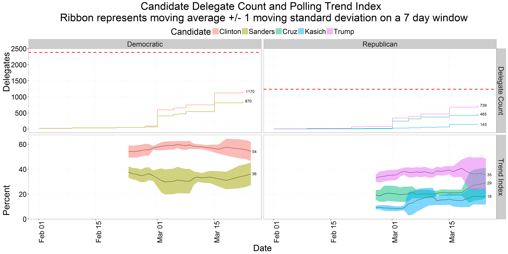
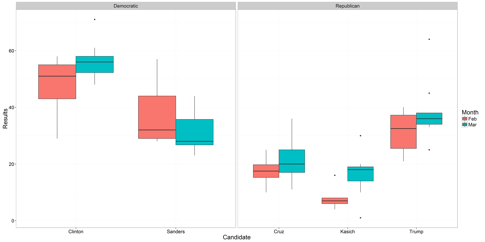
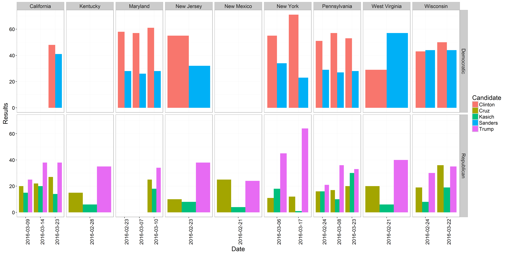
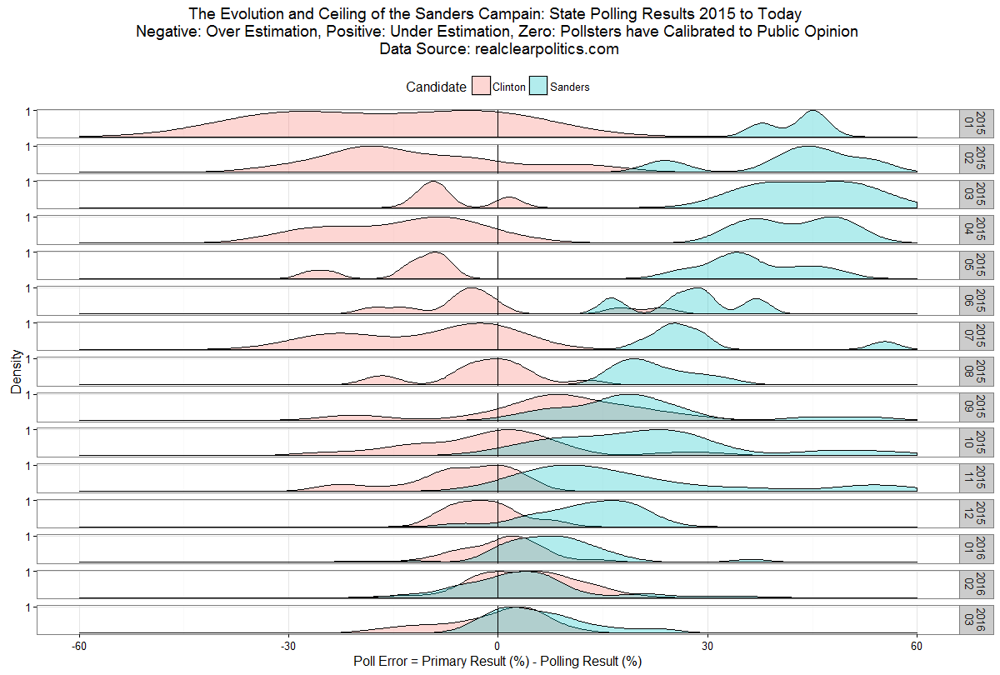
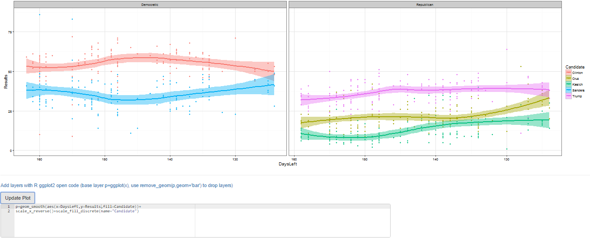
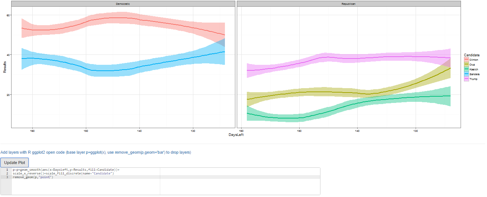
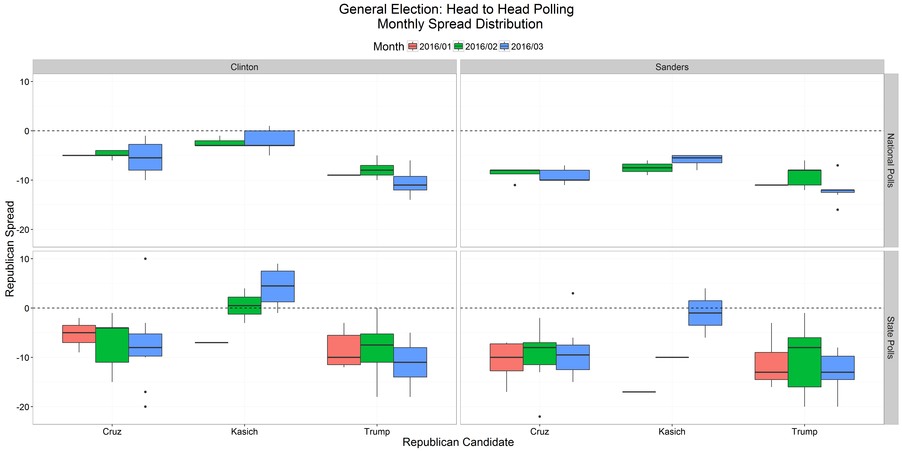
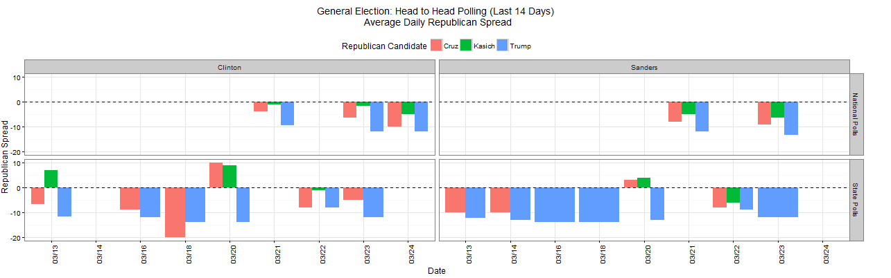

<!--- ####Fun with Polls: USA Edition --->

The US primaries are coming on fast with almost 120 days left until the conventions. After building a shinyapp for the [Israeli Elections](http://www.r-bloggers.com/israels-2015-election-polls-analysis-with-shiny-ggplot2/) I decided to update features in the app tried out plotly in the shiny framework.

As a casual voter trying to gauge the true temperature of the political landscape from the the overwhelming abundance of polling is a heavy task.  Polling data is continuously published during the state primaries and the variaety of pollsters makes it hard to keep track what is going on. The app self updates using data published publicly by [realclearpolitics.com](http://www.realclearpolitics.com).

The app keeps track of polling trends and delegate count daily for you. You create personal analysis from the granular level data all the way to distributions using interactive [ggplot2](http://ggplot2.org/) and [plotly](https://github.com/ropensci/plotly) graphs and check out the general elections polling to peak into the near future.

The app can be accessed through a couple of places. I set up an [AWS instance](http://54.191.51.69/Elections/USA2016/shiny) to host the app for realtime use and there is the Github repository that is the maintained home of the app that is meant for the R community that can host shiny locally. 

####Running the App through Github

```r
#changing locale to run on Windows
if (Sys.info()[1] == "Windows") Sys.setlocale("LC_TIME","C") 

#check to see if libraries need to be installed
libs=c("shiny","shinyAce","plotly","ggplot2","rvest","reshape2","zoo","stringr","scales","plyr","dplyr")
x=sapply(libs,function(x)if(!require(x,character.only = T)) install.packages(x));rm(x,libs)

#run App
shiny::runGitHub("yonicd/Elections",subdir="USA2016/shiny")

#reset to original locale on Windows
if (Sys.info()[1] == "Windows") Sys.setlocale("LC_ALL")

```

# Application Layout:

1. [Current Polling](#current-polling)
2. [Election Analyis](#election-analysis)
3. [General Elections](#general-elections)
4. [Polling Database](#polling-database)

# Usage Instructions:

## Current Polling
  * The top row depicts the current accumulation of delegates by party and candidate is shown in a step plot, with a horizontal reference line for the threshold needed per party to recieve the nomination. Ther accumulation does not include super delegates since it is uncertain which way they will vote. Currently this dataset is updated offline due to its somewhat static nature and the way the data is posted online forces the use of Selenium drivers. An action button will be added to invoke refreshing of the data by users as needed.
  * The bottom row is a 7 day moving average of all polling results published on the state and national level. The ribbon around the moving average is the moving standard deviation on the same window. This is helpful to pick up any changes in uncertainty regarding how the voting public is percieving the candidates. It can be seen that candidates with lower polling averages and increased variance trend up while the opposite is true with the leading candidates, where voter uncertainty is a bad thing for them.



## Election Analysis
  * An interactive polling analysis layout where the user can filter elections, parties, publishers and pollster, dates and create different types of plots using any variable as the x and y axis.

  * The default layer is the long term trend (estimated with loess smoother) of polling results published by party and candidate
  


The user can choose to filter in the plots States, Parties, Candidates, Pollsters. Next there is a slider to choose the days before the conventions you want to view in the plot. This was used instead of a calendar to make a uniform timeline that is cleaner than arbitrary dates. Since there are a lot of states left and no one keeps track of which ones are left an extra filter was added to keep just the states with open primaries.

The new feature added is the option to go fully interactive and try out plotly!. Its integration with ggplot is great and new features are being added all the time to the package.

The base graphics are ggplot thus the options above the graph give the user control on nearly all the options to build a plot. The user can choose from the following variables:
**Date, Days Left to Convention, Month, Weekday, Week in Month, Party, Candidate, State, Pollster, Results, Final Primary Result, Pollster Error, Sample Type (Registerd/Likely Voter), Sample Size**. There is an extra column in the [Polling Database](#polling-database) tab that gives the source URL of the poll that was conducted for anyone who wants to dig deeper in the data.

To define the following plot attributes:

|Plot Type|Axes|Grouping|Plot Facets|
|:-----:|:-:|:-:|:-:|
| Point |X axis variable| Split Y by colors using a different variable | Row Facet |
| Bar |Discrete/Continuous| |Column Facet |
| Line |Rotation of X tick labels|||
| Step |Y axis variable|||
| Boxplot ||||
| Density ||||

 * Create Facets to display subsets of the data in different panels (two more variables to cut data) there are two type of facets to choose from
     * Wrap: Wrap 1d ribbon of panels into 2d
     * Grid: Layout panels in a grid (matrix)
   

An example of the distribution of polling results in the open primaries over the last two months:


Zooming in to this trend we can see the state level polling


An analysis showing the convergence of polling errors to Sanders and Clinton over the Primary season. Initially Sanders was underestimated by the pollsters and over time the public sentiment has shifted. Currently the pollsters have captured the public sentiment to the primary outcomes. This can be seen as a ceiling to the Sanders campaign:


  * If you are an R user and know ggplot syntax there is an additional editor console,below the plot, where you can create advanced plots freehand, just add to the final object from the GUI called p and the data.frame is poll.shiny, eg p+geom_point(). Just notice that all aesthetics must be given they are not defined in the original ggplot() definition. It is also possible to use any library you want just add it to the top of the code, the end object must be a ggplot. This also works great with plotly so do not worry if you are in interactive mode.


```r
#new layer
p+geom_smooth(aes(x=DaysLeft,y=Results,fill=Candidate))+
scale_x_reverse()+scale_fill_discrete(name="Candidate")
```

  * You can also remove the original layer if you want using the function remove_geom(ggplot_object,geom_layer), eg p=p+remove_geom(p,"point") will remove the geom_point layer in the original graph


```r
#new layer
p=p+geom_smooth(aes(x=DaysLeft,y=Results,fill=Candidate))+
scale_x_reverse()+scale_fill_discrete(name="Candidate")

remove_geom(p,"point") #leaving only the trend on the plot
```

  * Finally the plots can be downloaded to your local computer using the download button.

## General Elections
  * A peak into the sentiment of the public on cross party polling. Democratic candidate vs Republican candidate. The plots are set up to show the republican spread (Republican Candidate - Democratic Candidate) on the y-axis.
  * The top plot is a longterm overview of the spread distributions with boxplots, while the bottom plot shows a daily account of the spread per candidate over the last two weeks. Both plots are split to National samples and State samples due to their heterogeneous nature.





## Polling Database
  * All raw data used in the application can be viewed and filtered in a datatable. There is an extra column that gives the source URL of the poll that was conducted for anyone who wants to dig deeper in the data.
